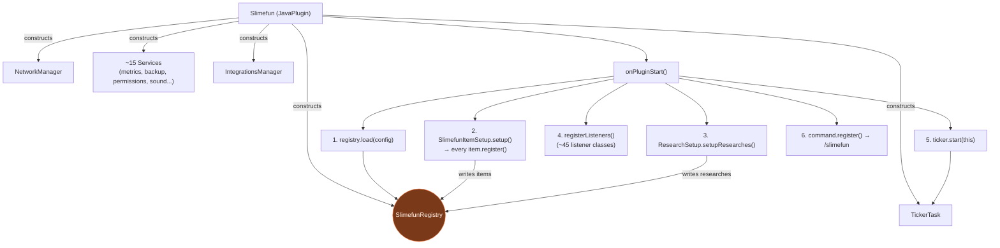
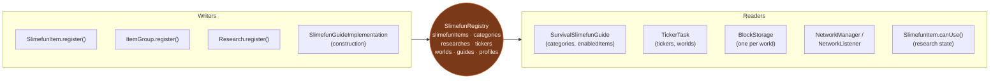
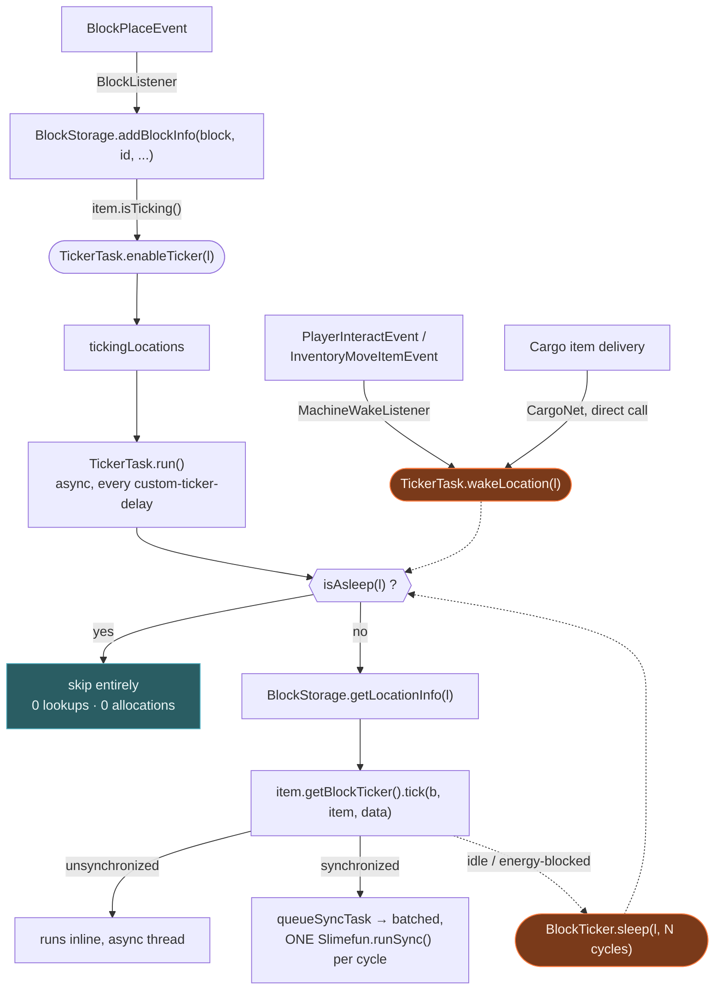
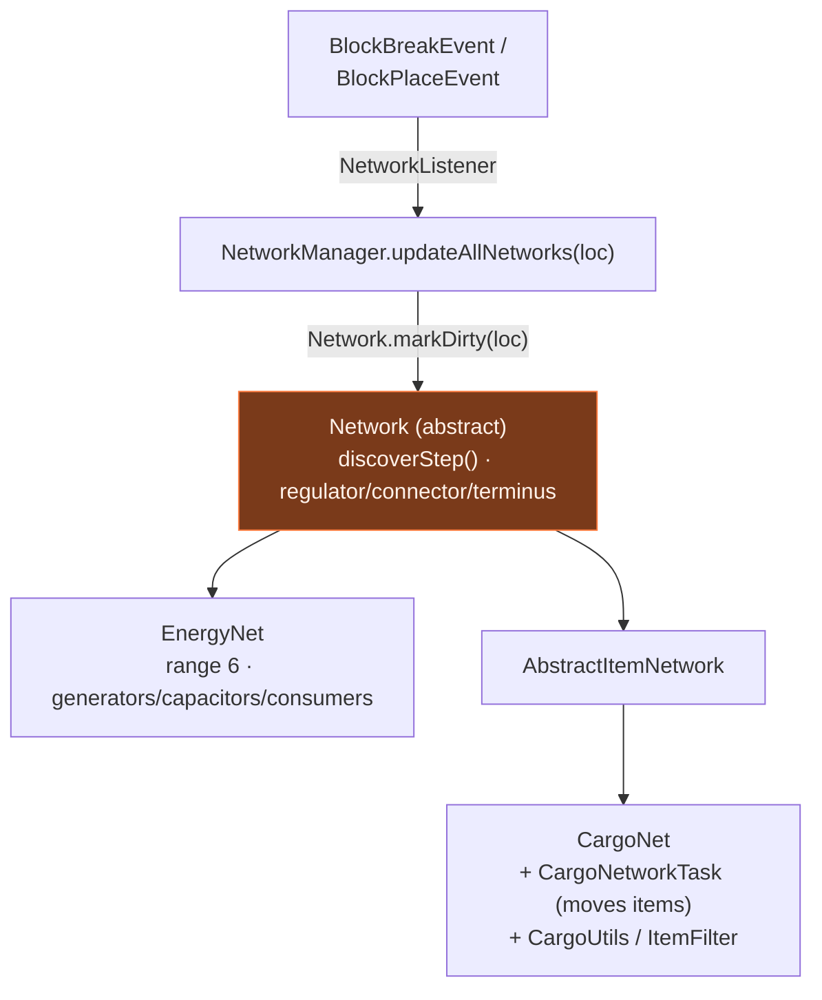
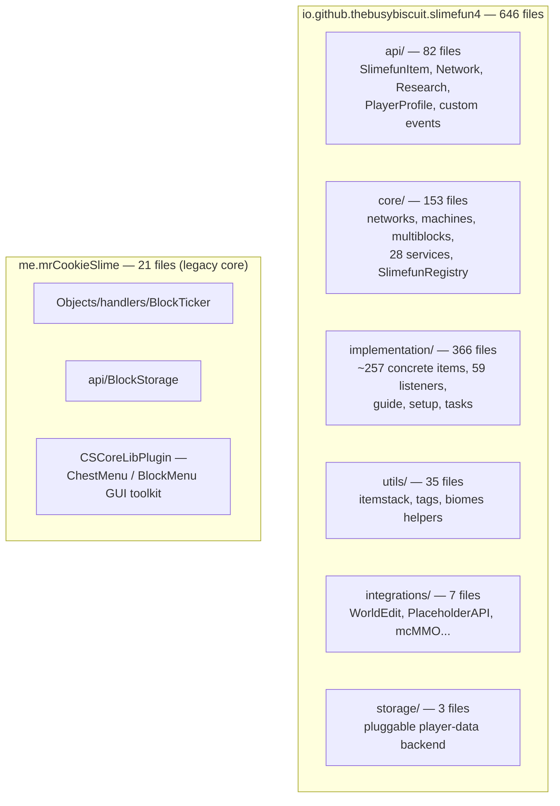

# Slimefun4 — Architecture & Connections

This document maps how Slimefun4's major subsystems connect to each other, and where each one lives
in the codebase. All diagrams are plain [Mermaid](https://mermaid.js.org/) — GitHub and VS Code
render them natively, no plugin needed.

A polished, illustrated version of the same material — hand-drawn connection diagrams styled as an
engineering schematic — is published separately as an HTML page (see the artifact link in chat).

---

## 1. Bootstrap — how the plugin wires itself together

`Slimefun` (the `JavaPlugin` subclass) constructs its core singletons at class-init, then
`onPluginStart()` wires them together in a fixed order.

**Reading it:** almost everything downstream of boot depends on step 1–3 having populated
`SlimefunRegistry` before listeners start firing and the ticker starts running.

---

## 2. The registry — the shared hub everything else reads or writes

`SlimefunRegistry` (`core/SlimefunRegistry.java`) has no interface and isn't passed around — every
subsystem reaches it through the static `Slimefun.getRegistry()`. Nothing in the plugin talks to
another subsystem directly; they talk to the registry.

---

## 3. One block's runtime life — from placement to ticking

The path a single machine takes from being placed in the world to being ticked every cycle. This is
also where the sleep/wake optimization lives: a sleeping location skips `BlockStorage` and
`BlockTicker` resolution entirely until something wakes it.

---

## 4. Two networks, one shared engine

`Network` (`api/network/Network.java`) is an abstract class, not an interface — it owns the shared
BFS-style discovery (`discoverStep()`) that classifies every queued location as a regulator,
connector, or terminus. `EnergyNet` and `CargoNet` both extend it and only supply their own
classification rules.

---

## 5. Where it all lives — package map

667 source files total: 646 under `io.github.thebusybiscuit.slimefun4`, plus 21 in the legacy
`me.mrCookieSlime` package — which is still load-bearing, not dead code (`BlockStorage` and
`BlockTicker` both live there).

---

## Key classes reference

| Class | Path | Role |
|---|---|---|
| `Slimefun` | `implementation/Slimefun.java` | Main plugin class; constructs and wires every subsystem in `onPluginStart()` |
| `SlimefunRegistry` | `core/SlimefunRegistry.java` | Central in-memory hub every other subsystem reads/writes through |
| `SlimefunItem` | `api/items/SlimefunItem.java` | Base class for every item/machine; owns handler attachment and `canUse()` gating |
| `BlockStorage` | `me/mrCookieSlime/Slimefun/api/BlockStorage.java` | Per-world block-data persistence; one instance per loaded world |
| `BlockTicker` | `me/mrCookieSlime/Slimefun/Objects/handlers/BlockTicker.java` | Abstract handler for tickable machines; owns sleep/wake helpers |
| `TickerTask` | `implementation/tasks/TickerTask.java` | The async loop that ticks every registered machine location |
| `Network` | `api/network/Network.java` | Shared abstract engine (BFS discovery) behind both network types |
| `EnergyNet` / `CargoNet` | `core/networks/energy/` · `core/networks/cargo/` | The two concrete network implementations |
| `NetworkManager` | `core/networks/NetworkManager.java` | Indexes all active networks by location/regulator |
| `Research` | `api/researches/Research.java` | Unlock gate; checked from `SlimefunItem.canUse()` |
| `SlimefunGuideImplementation` | `core/guide/SlimefunGuideImplementation.java` | Interface behind the Survival and Cheat-Sheet guide GUIs |

No existing public method signature changes with any of this — it's a map of what's already there,
not a proposed change.
